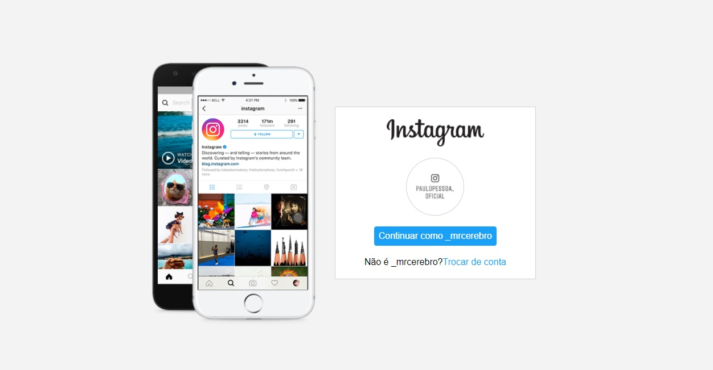

# Olá, devs 👋!	

Aqui estão algumas idéias sobre mim para você começar:

- 🌱 Atualmente estou estudando **(Javascript, ReactJS e TypeScript(*agendado*))**;
- 👯 Estou procurando colaborar no desenvolvimento social e projetos open-source;
- 🤔 Estou procurando ajuda para muitos projetos, tente entrar em contato comigo!:
- 💬 Me pergunte sobre qualquer coisa **[Paulo Pessoa](mailto:mrcerebro8@gmail.com)**.

	
## Projecto : REACRIANDO A PÁGINA INICIAL DO INSTAGRAM

	
Nesse projeto você terá o desafio de reconstruir a página de login do Instagram. Para isso, é recomendado o uso de CSS com Flexbox, uma das abordagens de posicionamento de elementos mais utilizadas quando se trata de responsividade. Além disso, a expert disponibiliza todo o material necessário em seu GitHub para que você possa utilizá-lo como referência para a sua solução.

## Objectivo do desafio

Conhecer as minhas skills em desenvolvimento, uma vez que sempre desenvolvi tudo simplesmente por estudo
Hoje apresento-vos algo que poderá mudar a minha rotina no apreendizado, tanto em desenvolvimento web **(frontend)**, quanto em design **(UX/UI Design)**

## Dificuldades

Colocar o slider no Celular do Instagram em várias telas, na minha tela de 1024x768 funcionou normalmente, mas em outras medias ficaram distorcidos, isso é algo que estou estudando para posterior resolver.

## Características do projecto

- Responsivo
- Simples
- Bonito
- Interativo (faltou alguns ajustes para isso)

## O quê que aprendeu

Desenvolver um projecto que poderá dar solução em determinado serviço.
Entender como funciona o posicionamento dos objectos usando o *CSS Flexbox*
Tudo sem frameworks nem bibliotecas, apenas as tecnologias: ***HTML***, ***CSS (Flexbox)***

## Redes Sociais

- Behance: [Paulo Pessoa](https://www.behance.net/mr-cerebro)
- Dribble: [Paulo Pessoa](https://dribbble.com/mr-cerebro)
- Facebook: [Paulo Pessoa](https://www.facebook.com/paulo1pessoa)
- Instagram: [Paulo Pessoa](https://www.instagram.com/_mrcerebro/)
- Linkedin: [Paulo Pessoa](https://www.linkedin.com/in/paulo-pessoa-2777841b2/)
- Twitter: [Paulo Pessoa](https://twitter.com/PauloPe65041263)

# Hello devs 👋!

Here are some ideas about me to get you started:

- 🌱 I'm currently studying **(Javascript, ReactJS and TypeScript(*scheduled*))**;
- 👯 I'm looking to collaborate on social development and open-source projects;
- 🤔 I'm looking for help for many projects, try contacting me!:
- 💬 Ask me about anything **[Paulo Pessoa](mailto:mrcerebro8@gmail.com)**.

## Project: RECREATING THE INSTAGRAM HOMEPAGE

	
In this project you will have the challenge of rebuilding the Instagram login page. For this, it is recommended the use of CSS with Flexbox, one of the most used element positioning approaches when it comes to responsiveness. In addition, the expert makes all the necessary material available on its GitHub so that you can use it as a reference for your solution.

## Challenge objective

Knowing my skills in development, since I've always developed everything simply by studying
Today I present to you something that could change my routine in apprehended, both in web development **(frontend)**, and in design **(UX/UI Design)**

## Difficulties

Putting the slider on Instagram Mobile on multiple screens, on my 1024x768 screen it worked normally, but on other media they were distorted, this is something I'm studying to solve later.

## Project Features

- Responsive
- Simple
- Beautiful
- Interactive (missed some adjustments for that)

## what you learned

Develop a project that can provide a solution in a given service.
Understand how object positioning works using *CSS Flexbox*
All without frameworks or libraries, just the technologies: ***HTML***, ***CSS (Flexbox)***

## Social networks

- Behance: [Paulo Pessoa](https://www.behance.net/mr-cerebro)
- Dribble: [Paulo Pessoa](https://dribbble.com/mr-cerebro)
- Facebook: [Paulo Pessoa](https://www.facebook.com/paulo1pessoa)
- Instagram: [Paulo Pessoa](https://www.instagram.com/_mrcerebro/)
- Linkedin: [Paulo Pessoa](https://www.linkedin.com/in/paulo-pessoa-2777841b2/)
- Twitter: [Paulo Pessoa](https://twitter.com/PauloPe65041263)
